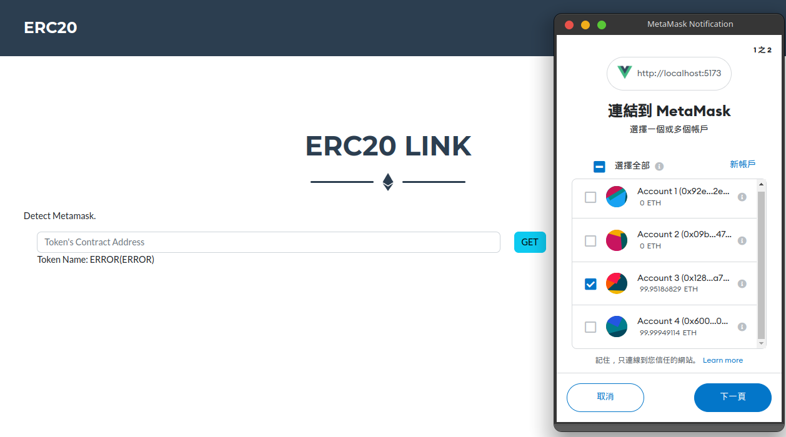
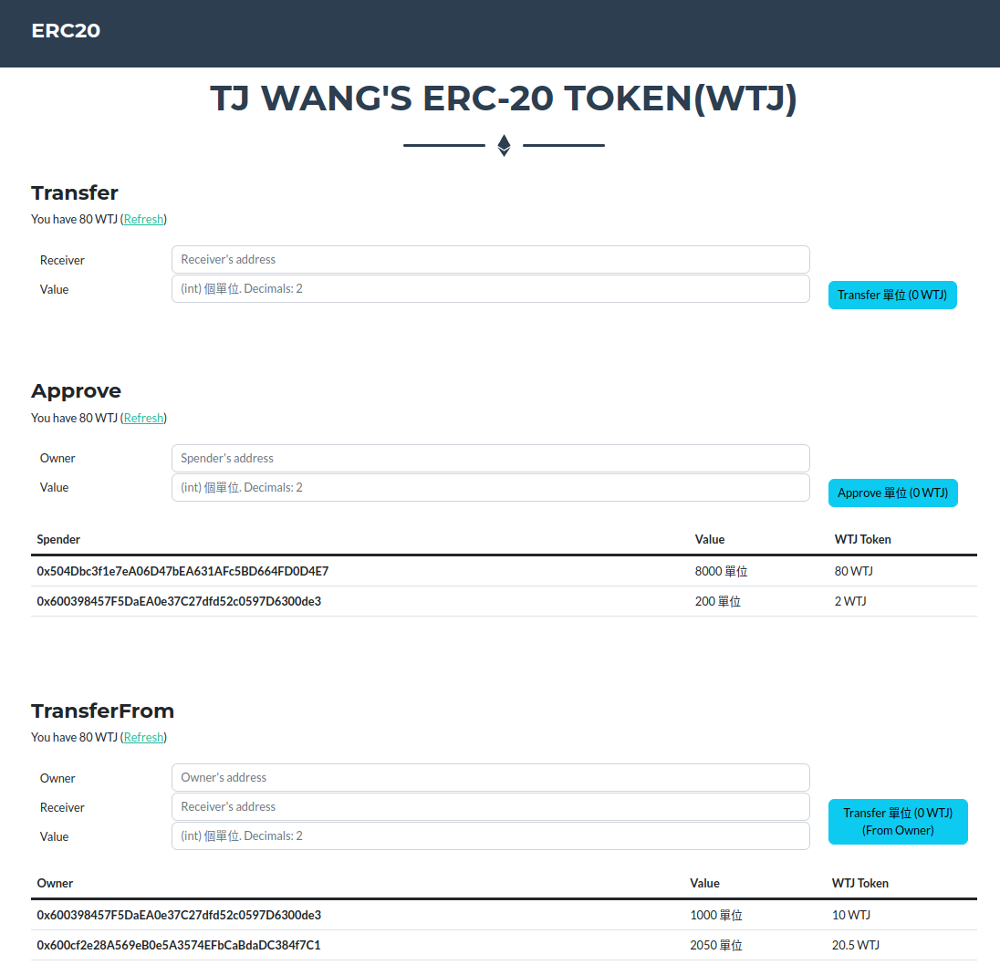

# ERC-20 Management Webpage

It's HW3 for 1112 NCNU CSIE "Principles and Practice of Blockchains"

link to Metamask and manage your ERC-20 token on Sepolia Testnet.

- Demo: https://snsd0805.com/ERC20





## Project Setup

```sh
npm install
```

### Compile and Hot-Reload for Development

```sh
npm run dev
```

### Compile and Minify for Production

```sh
npm run build
```